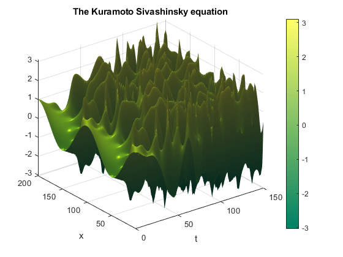

# A Solution to the Kuramoto-Sivashinsky Equation

This repo contains simulations that will plot the behaviour of the [Kuramoto-Sivashinsky Equation](https://en.wikipedia.org/wiki/Kuramoto%E2%80%93Sivashinsky_equation) in both Python and MATLAB. You can quite easily tweak the variables to get different levels of detail etc.

### Usage

Just run a program, and a plot will be produced.

Here is an example plot (produced using MATLAB) for the initial condition u=cos(x/16):

